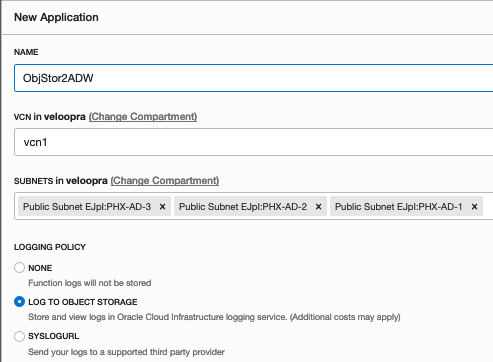

# Automate Loading of Bulk Exported OCI Audit Event Logs to ADW.

This documentation shows the step by step procedure to automate the loading of OCI Audit events from gzip files exported to OCI OBject Storage buckets by OCI Audit service bulk export feature to an OCI ADW table. Once the Audit events are loaded into ADW, we can run SQL queries to generate Audit reports easily based on the requirement.

We are leveraging **OCI Audit**, **OCI Object Storage**, **OCI Events**, **OCI Function** and **OCI Autonomous Database(ADW)** services to accomplish the task mentioned above.

## High Level Architecure

You can enable OCI Audit event log bulk export in your OCI tenancy by following:https://docs.cloud.oracle.com/iaas/Content/Audit/Concepts/bulkexport.htm

Once the Audit event bulk export is enabled, the Audit event logs are exported to OCI Object Storage buckets as gzip files. Separate Object Storage buckets are created for Audit events exported from each compartment. The bucket names has the prefix format "oci-logs.\_audit", we can use this prefix as a filter parameter in OCI Events service to trigger an event whenever an Audit events log file is exported to these Object Storage buckets.

**Audit Event Bulk Export Buckets**

**Audit Event Log Files**

## Steps:

1. Make sure the Object Storage buckets has "Emit Object Events" enabled. Reference: https://docs.cloud.oracle.com/iaas/Content/Object/Tasks/managingbuckets.htm#usingconsole

 

 

2. Create an ADW instance(if doesn't exists one)download the credentials and configure access to it as mentioned in: https://oracle.github.io/learning-library/workshops/journey4-adwc/?page=LabGuide1.md

3. Connect to ADW and create a table as mentioned in: https://docs.oracle.com/database/121/ADXDB/json.htm#ADXDB6371
   
  

4. Create credentials in ADW to access OCI Object Storage as mentioned in: https://docs.oracle.com/en/cloud/paas/autonomous-data-warehouse-cloud/user/dbms-cloud.html#GUID-742FC365-AA09-48A8-922C-1987795CF36A
   
  
  
5. Create an Application of your desired name(Ex: ObjStor2ADW)from OCI console by following:https://docs.cloud.oracle.com/iaas/Content/Functions/Tasks/functionscreatingapps.htm#console 

  

6. Setup your tenancy for OCI Function development and configure your local PC/Laptop/VM for OCI Function development by  following:
https://docs.cloud.oracle.com/iaas/Content/Functions/Tasks/functionsconfiguringtenancies.htm
https://docs.cloud.oracle.com/iaas/Content/Functions/Tasks/functionsconfiguringclient.htm
  
7. Clone/Download this(https://github.com/sherinchandy/oci-audit-events-to-adw.git) github repo into your local directory. Unzip the ADW credentials downloaded in step 1 into the same directory.

  
  
  
  

8. Edit the file "func.py" and update it with the OCI region where you are enabling the Audit log bulk export. Also update DB user name, password and DB service name from your ADW environment.

  

9. Edit the file "func.yaml" and specify your preferred name(Ex: name: objstor2adw) for the OCI Function. 

  

10. Deploy the function and configure the function environment variables are set(Ex: TNS_ADMIN). This step should push the Function image to OCIR service and attach the function to the OCI Function service Application created in step 5.
 
  
  
  
  

11. Make sure you are now able to see the Function created in previous step is appearing in the OCI Function service Application's console. 

  

12. Create an Event rule in Event service to generate an event when Audit Event log file is bulk exported/uploaded to an Object Storage bucket. We can use "Object-Create" as event type, bucket name prifix "oci-logs.\_audit" as event attribute and the Function created in step 10 as Action item. Reference: https://docs.cloud.oracle.com/iaas/Content/Events/Concepts/eventsgetstarted.htm#Console

  

13. Wait few minutes for the Audit Event gzip files to get uploaded to Object Storage. Test and verify that Audit Events in bulk exported gzip files are loaded in the ADW table created in step 3. Check whether the table has raws getting added.

  

14. Since the JSON data loaded into the table is of BLOB type, we can create a view on the table and run SQL queries to get insight into the Audit logs. In addition to the view created in below example, we can create views using any of the key names as the view's column name from the Audit event JSON document. Refer: https://docs.cloud.oracle.com/iaas/Content/Audit/Reference/logeventreference.htm for details about Audit event contents.

  

15. Run SQL queries to generate audit report on the view created in above step. In additional to the example SQL query shown below, we can run any SQL query based on the requirement and visualize using any tools of choice.
  
  

